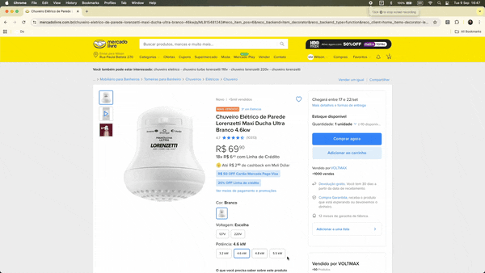
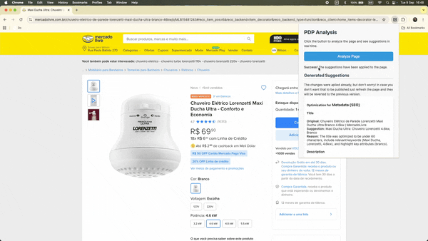

# 🤖 PDP AI: LLM-generated for Merchandisers

PDP AI: LLM-generated for Merchandisers is a Chrome extension that uses Google's Gemini AI to analyze and optimize product detail pages (PDPs) for SEO and customer experience. It provides real-time suggestions and allows users to apply changes directly to the page.

---

## 📦 Architecture & Workflow

- **Manifest v3**: Secure, modern Chrome extension structure.
- **Service Worker (`background.js`)**: Handles Gemini API calls and workflow.
- **Content Script (`content.js`)**: Bridges extension and page context.
- **DOM Updater (`dom-updater.js`)**: Injected to update the DOM with AI suggestions.
- **Popup UI (`popup.html`, `popup.js`, `popup.css`)**: User interface for analysis and suggestions.
- **Options Page (`options.html`, `options.js`)**: Secure API key management.

### Data Flow
1. User clicks "Analyze Page" in the popup.
2. Page HTML is sent to Gemini API via background script.
3. Suggestions are returned and displayed in the popup.
4. User reviews and applies changes, which are injected into the page.

### Security & Privacy
- API key is stored securely in Chrome local storage.
- Only explicit user actions trigger page changes.

---

## 🛠️ Installation & Setup

1. **Clone the Repository:** Download the source code.
2. **Enable Developer Mode:** Go to `chrome://extensions` and enable "Developer mode".
3. **Load Unpacked Extension:** Select the project folder.
4. **Get Gemini API Key:** [Google AI Studio](https://aistudio.google.com/app/apikey)
5. **Configure Extension:** Paste your API key in the options page.

---

## 🚀 Usage

1. Go to any product page (PDP).
2. Click the extension icon and "Analyze Page".
3. Review suggestions for SEO and UX in the popup.
4. Apply changes if desired (refresh to revert).

---

## ✅ Validation & Testing

- Manual testing via Chrome extension developer mode.
- Error handling for API key and network issues.
- UI and DOM update validation on sample PDPs.

---

## How to use

## Results - Extension in Action

## 🚧 Future Improvements

- i18n: Multi-language support for global users.
- Change reversion: Undo applied changes without refresh.
- Suggestion history: Log and browse previous suggestions.
- Prompt customization: User control over AI instructions.
- User feedback: Rate AI suggestions for future improvement.
- Image optimization: Analyze and suggest alt text for images.
- More PDP properties: Support for bullet points, specs, reviews, etc.

---

## 📄 Project Design Review (PDR)

See `PDR.md` for a detailed technical and architectural review of the project.